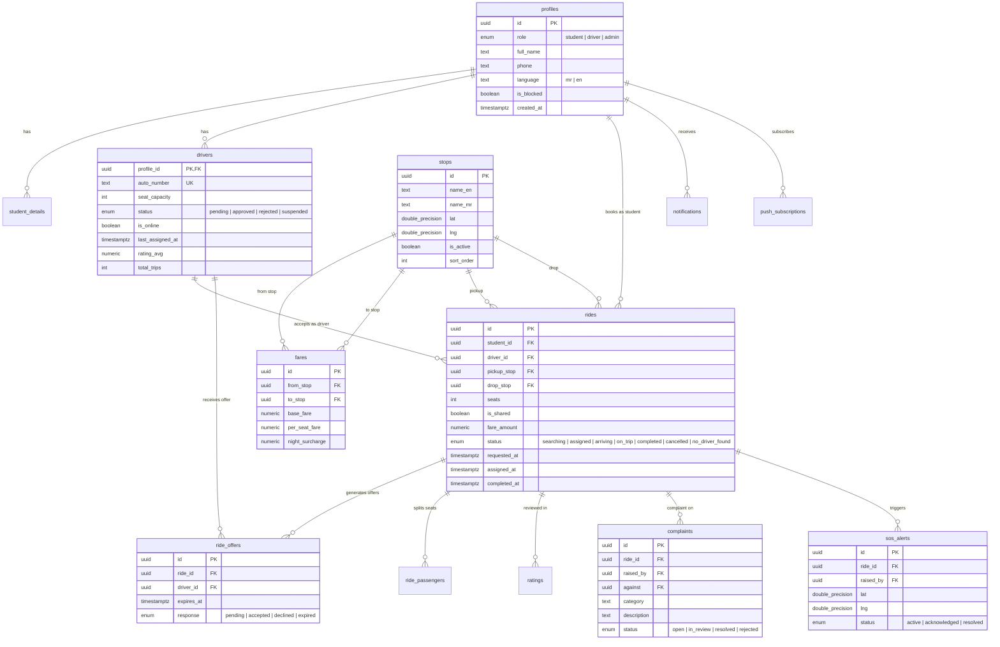

# Ride Mitra — Database ER Diagram

The database is built on **Supabase (PostgreSQL 15+)** with Row Level Security (RLS) enabled on every table.

```mermaid
erDiagram
    profiles ||--o{ student_details : "has"
    profiles ||--o{ drivers : "has"
    profiles ||--o{ rides : "books as student"
    drivers ||--o{ rides : "accepts as driver"
    stops ||--o{ fares : "from stop"
    stops ||--o{ fares : "to stop"
    stops ||--o{ rides : "pickup"
    stops ||--o{ rides : "drop"
    rides ||--o{ ride_offers : "generates offers"
    drivers ||--o{ ride_offers : "receives offer"
    rides ||--o{ ride_passengers : "splits seats"
    rides ||--o{ ratings : "reviewed in"
    rides ||--o{ complaints : "complaint on"
    rides ||--o{ sos_alerts : "triggers"
    profiles ||--o{ notifications : "receives"
    profiles ||--o{ push_subscriptions : "subscribes"

    profiles {
        uuid id PK
        enum role "student | driver | admin"
        text full_name
        text phone
        text language "mr | en"
        boolean is_blocked
        timestamptz created_at
    }

    drivers {
        uuid profile_id PK,FK
        text auto_number UK
        int seat_capacity
        enum status "pending | approved | rejected | suspended"
        boolean is_online
        timestamptz last_assigned_at
        numeric rating_avg
        int total_trips
    }

    stops {
        uuid id PK
        text name_en
        text name_mr
        double_precision lat
        double_precision lng
        boolean is_active
        int sort_order
    }

    fares {
        uuid id PK
        uuid from_stop FK
        uuid to_stop FK
        numeric base_fare
        numeric per_seat_fare
        numeric night_surcharge
    }

    rides {
        uuid id PK
        uuid student_id FK
        uuid driver_id FK
        uuid pickup_stop FK
        uuid drop_stop FK
        int seats
        boolean is_shared
        numeric fare_amount
        enum status "searching | assigned | arriving | on_trip | completed | cancelled | no_driver_found"
        timestamptz requested_at
        timestamptz assigned_at
        timestamptz completed_at
    }

    ride_offers {
        uuid id PK
        uuid ride_id FK
        uuid driver_id FK
        timestamptz expires_at
        enum response "pending | accepted | declined | expired"
    }

    complaints {
        uuid id PK
        uuid ride_id FK
        uuid raised_by FK
        uuid against FK
        text category
        text description
        enum status "open | in_review | resolved | rejected"
    }

    sos_alerts {
        uuid id PK
        uuid ride_id FK
        uuid raised_by FK
        double_precision lat
        double_precision lng
        enum status "active | acknowledged | resolved"
    }
```
